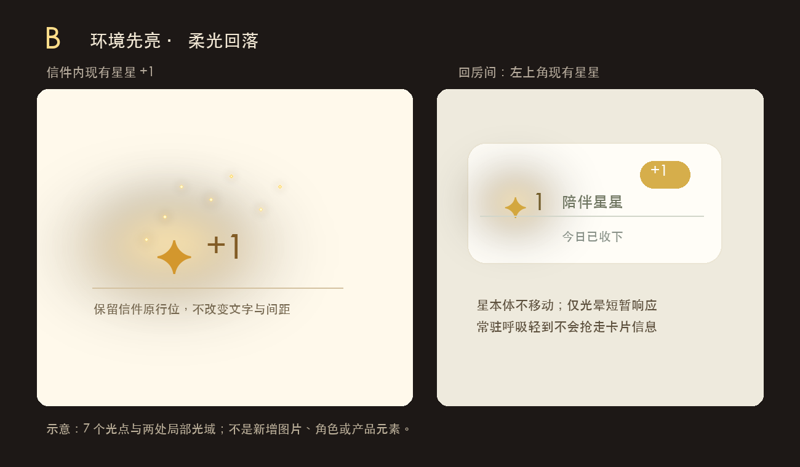

# 蛋宝宝｜陪伴星星光效视觉方案

> 日期：2026-09-22 · 状态：待 COO 选择 · 交付性质：视觉研究与实现约束，不含 WXSS / WXML / JS 代码  
> 适用位置：信件内现有 `✦ +1`、回房间后左上角“今日心情”卡的现有 `✦` 与 `+1`

## 1. 判断依据与限制

本方案以 [陪伴星星视觉效果任务书](https://github.com/octopusgump/eggbabe-miniprogram/blob/docs/star-effect-brief-20260922/docs/development/%E8%9B%8B%E5%AE%9D%E5%AE%9D_%E9%99%AA%E4%BC%B4%E6%98%9F%E6%98%9F%E8%A7%86%E8%A7%89%E6%95%88%E6%9E%9C_%E4%BB%BB%E5%8A%A1%E4%B9%A6_20260922.md)、现有页面样式和 COO 在对话中提供的三张静态参考图为准。图 1 给出通透的奶黄色星体，图 2 给出黄色主调、暗环境中的小范围光点，图 3 给出最重要的关系：发光体不是孤立地“加外发光”，暖光会柔和地照亮近旁表面。三图均不是《旷野之息》连续游戏录像，亦不是要复制进产品的素材；第三方图片及水印不随仓库分发。

COO 已确认：颜色以图 2 的黄色为准，光的空间质感以图 3 为准，信件内 **5–8 个光点必须保留**。此前“暖金 / 青白 / 极轻光尘”三稿均被否决；因此本轮的主角是局部光域的生成与退去，光点只帮助感知运动，不能变成漫天撒粉。两版都采用 7 个细小光点作为设计标称值，落在允许的 5–8 范围内。

### 视觉哲学：掌心余温

光先属于一个已有的物体，再被周围的空间轻轻接住。中心不靠刺眼的纯白取胜，周边也不画醒目的同心圆；观看者先感到颜色变暖，后察觉光的边界。画面应像仔细打磨过的材质实验，而不是套用一层现成滤镜。

浅色纸面仍要留有呼吸。暖黄只占星星附近一小块，深蜜色负责把形体稳住，大片原有奶油色保持不动；这种精心克制的比例，比提高全屏亮度更接近参考图的安静。每一层透明度都应经过细致校准，避免在浅底上变脏。

节奏是一次“被收下”的动作，而不是庆典。5–8 个点错时浮起，各走短程，不围成几何圆环，也不齐刷刷爆开；主光比它们更早出现、更晚退去。这样的时间关系需要像手工动画一样反复打磨，不能由随机飞散代替。

视觉重心永远留给信件和卡片原有信息。房间里的常驻光几乎不被主动注意，奖励发生时才给出一瞬回应；版式、文字、触点和已有层级一律不为光效让位。这是一套以极高工艺精度服务现有体验的语言，不是增加一个新角色或一张新海报。

## 2. 从静态参考可确认什么、不能确认什么

以下色值是对 COO 图片内局部像素的取样与适配建议，不是《旷野之息》的官方色值，也不是小程序实机校色结果。图 2 星体取样约 `#FFDD79`、中间色约 `#F7CC6E`；图 3 近旁暖光取样约 `#F3BB5A`。考虑现有信件底色 `#FFF9EB`、卡片浅底 `rgba(255,253,247,.9)`，设计采用这些颜色的低透明度版本，不直接把图 3 的黑背景和亮度反差搬过来。现有信件 `✦ +1` 文字色 `#9A782C`、房间星图标色 `#D1A73F` 为排版基线。

| 拆解项 | 参考图可见 / 不可见 | 转译决策 |
| --- | --- | --- |
| 色彩 | 黄白中心、蜜黄过渡、琥珀色近旁反光 | 主光 `#FFDD79`，柔光 `#F7CC6E`，极弱环境反光 `#F3BB5A`；不使用青白色 |
| 亮度曲线 | 静态图只能确认层次，不能测得随时间变化 | A 与 B 的曲线均为下文的**设计提案**，用相对亮度 0–1 表示，不冒称逐帧实测 |
| 持续时间、粒子运动 | 静态图无法测出帧数、速度、方向或拖尾 | 以任务书的 `≤1.8 s` 和 5–8 点上浮为硬边界，具体时间轴待 COO 选版后实机微调 |
| 景深 | 图 2、3 有摄影/渲染式柔焦，静态图无法反推真实景深参数 | 放弃真实景深；只用低透明度的层叠柔光表达“近亮远柔” |
| 声音、震动 | 静态图无法判断 | 产品明确无声音；本案也不加震动。没有音效或触觉反馈的“占位要求” |

**逐帧研究声明：**COO 的指认对象是三张静帧，不是带时间码的视频，因此无法诚实提供原画面的逐帧亮度、粒子轨迹或音轨数据。下表是把静帧视觉关系翻译成可验收的 0.1 秒精度动画提案；若后续提供视频，可再增加实测拆解，不能把本提案误写为原作测量值。

## 3. 落地语法与明确放弃项

只在任务书允许的信件星星行及 `pet-mood-tab` 星星区域，使用现有 `✦`、现有 `+1`、WXSS 动画和无交互、无文字的装饰 `view`。现有信件把 `✦ +1` 写在同一个文本节点里，且任务书不允许拆改文本；所以短暂缩放若用于文字，只能作用于整行（不改变排版尺寸），不能声称单独放大 `✦`。若整行缩放在人工验收时不合适，优先只放大装饰光核、让文字始终保持 1.0 倍。光点只是这些装饰 `view` 的微小形态，不是新入口、新奖励物或新角色。不得使用图片序列、canvas、第三方库、声音；不写新业务逻辑。`reducedMotion` 为真时取消所有动效，只保留原有文字符号和状态。

需要放弃：图 1/2 的立体星体外形与面部、真实场景光照 / 手部受光、物理景深、镜头眩光、可持续拖尾、全屏光束、信件到左上角的连续飞行、跨页面粒子传递、随机粒子系统、同步音效与震动。这些视觉项超出允许技术和局部 DOM 边界；连续飞行与跨页面传递还会制造现有交互并未提供的空间连续性。可保留的是“信件处收下 → 关闭后卡片响应”的节奏呼应，而非同一粒子的真实飞行。

信件动画仅在现有 `todayCompanionAwardedStars > 0` 第一次出现时播放；再次打开信件时既有状态将其复位为 0，不能重复演出。房间动画只跟随现有 `starAwardVisible`，与现有 `+1` 同时出现；不因常驻光呼吸而再次奖励。装饰层不拦截点击、不改变两处点击区域。样式实现前须在微信开发者工具确认多层柔光的实际兼容性；若渐变或阴影在目标基础库表现不稳定，减少层数与模糊，不能为了“还原摄影感”引入图片或 canvas。

## 4. 方案 A：芯光先醒，小范围收束

信件里，原有 `✦` 像一枚薄薄的暖黄材料被从内部点亮；靠近它的纸面先有一个指腹大小的柔光区，7 个低亮小点错时从旁边短距离上浮，随后先消失，光域最后退去。不是新画一颗有表情的星，也不是围星转一圈的粉尘。关闭信件后，卡片内原有星图标迅速亮一下并回到日常，`+1` 原样出现。该版更接近图 1 的“星本身有厚度”，但用图 3 的受光关系收尾。

示意图为了看清光域放大了星与间距；开发以原界面尺寸为准，图中的说明字不进入产品。

| 收星瞬间：相对成功回调时间 | 星与局部光 | 7 个光点 / 状态 |
| --- | --- | --- |
| 0.0–0.1 s | 现有 `✦ +1` 出现；整行视觉尺度 0.88→0.94 倍，光域透明度 0→0.10 | 全部不可见 |
| 0.1–0.3 s | 芯光升至相对亮度 1.00；整行 0.94→1.04 倍；暖黄光域扩到星字面宽约 2.0 倍 | 第 1–3 点依次出现，不同步爆开 |
| 0.3–0.6 s | 整行回到 1.00 倍；光域由峰值回落至 0.65 | 第 4–7 点依次出现，每点向上 0.4–0.8 倍星字面宽，略向两侧错位 |
| 0.6–1.1 s | 光域慢退至 0.28；纸面只留浅暖 | 光点逐粒减至 0，不出现尾线或旋转 |
| 1.1–1.6 s | 光域降到 0，原有文字保持可见、可点击 | 全部结束；1.6 s 静止 |

亮度关键点（提案，相对值）：`0.0/0.0 → 0.1/0.25 → 0.3/1.00 → 0.6/0.65 → 1.1/0.28 → 1.6/0.0`。这里的“亮度”是视觉强弱标尺，不是设备屏幕亮度或真实光照单位。

- **回房间**：关闭信件时 `0.0 s` 原有 `+1` 立即出现；星周围光晕 `0.0–0.2 s` 升到峰值，`0.2–0.8 s` 缓退，`0.8–1.2 s` 完全静止。2–3 个极弱光点可向星内靠近，不能跨出卡片；星本体无位移、无放大。
- **常驻**：3.6 s 一轮，只让内侧光晕透明度在 `0.06–0.18` 间往返（差 `0.12`）；星不位移、不放大，不做“亮灭闪烁”。
- **规格**：现有 `✦ +1` 行 1.0 倍为终态；瞬间峰值 1.04 倍。信件内光域最大宽 2.0 倍星字面宽，环境反光最远 2.5 倍；光域透明度 `0–0.22`，光点直径 `3–5 rpx`、透明度 `0–0.42`。颜色为芯光 `#FFDD79`、外层 `#F7CC6E`、近纸面反光 `#F3BB5A`；原有 `+1` 不改字色。

## 5. 方案 B：环境先亮，柔光回落

信件里先有一层很淡的暖意漫到 `✦` 周围，随后原有星被“托亮”；7 个光点像小范围空气里的反射，起点、速度都不相同，但仍然只在星附近缓慢上浮。主体验不是星字突然放大，而是图 3 那种“附近也被照到”的片刻。回房间后卡片内暖光比 A 稍宽、峰值稍低，像余温，不像一次开奖。该版更贴近 COO 指定的图 3 空间光感。

示意图只表达光域范围与层次，不表示改变卡片背景、尺寸或在页面增加文案。

| 收星瞬间：相对成功回调时间 | 星与局部光 | 7 个光点 / 状态 |
| --- | --- | --- |
| 0.0–0.2 s | 现有 `✦ +1` 出现；整行 0.92→0.98 倍；周围纸面先有低亮暖光，达到相对亮度 0.42 | 第 1–2 点以低透明度出现 |
| 0.2–0.5 s | 光域铺到最大宽 2.8 倍星字面宽；整行最多到 1.03 倍，整体相对亮度到 1.00 | 第 3–7 点错时出现，仍不形成圆形爆点 |
| 0.5–0.9 s | 整行回 1.00 倍；外层柔光保持约 0.72→0.50 | 每点向上 0.5–1.0 倍星字面宽，轻微横向漂移，无拖尾 |
| 0.9–1.3 s | 光域退到 0.22；中心仍比边缘稍暖 | 光点逐粒消散至 0 |
| 1.3–1.7 s | 光域完全退去；原有文字不消失 | 全部结束；1.7 s 静止 |

亮度关键点（提案，相对值）：`0.0/0.0 → 0.2/0.42 → 0.5/1.00 → 0.9/0.50 → 1.3/0.22 → 1.7/0.0`。与 A 不同，B 是外层先起、芯光后到峰值；二者不能仅靠更换粒子颜色区分。

- **回房间**：关闭信件时 `0.0 s` 原有 `+1` 出现；星附近的低亮余光 `0.0–0.3 s` 渐起，`0.3–0.9 s` 缓退，`0.9–1.2 s` 回到常驻基线。2–3 个极弱点可在卡片内上浮后融入星附近；不做从信件飞来的连续轨迹。
- **常驻**：3.8 s 一轮，仅暖光透明度在 `0.05–0.16` 间缓慢往返（差 `0.11`）；无位移、无尺度变化。
- **规格**：现有 `✦ +1` 行终态 1.0 倍，瞬间峰值 1.03 倍。信件光域最大宽 2.8 倍星字面宽，但边缘必须非常淡；局部透明度 `0–0.18`，光点直径 `2–4 rpx`、透明度 `0–0.35`。颜色为星旁 `#FFDD79`、漫射 `#F7CC6E`、最外层 `#F3BB5A`；原有 `+1` 不改字色。

## 6. 共同验收口径与明确不做

两版都只在现有信件收星成功时播放一次，不阻断任何点击；单次信件演出分别在 1.6 / 1.7 s 结束，不超过 1.8 s。房间反应 1.2 s 结束，现有 `+1` 显示窗仍按当前 1.6 s，不要求改 JS。常驻光晕透明度摆幅分别为 0.12 / 0.11，均不超过任务书的 0.25；在 reduced-motion 下取消动画。低端设备若卡顿，优先减少阴影层和光点复杂度，但保留 5–8 个光点数量与两处触发关系。

不改信件标题、正文、“明天呢？”、任何字距 / 行高 / 间距 / 布局；不改左上角卡片宽度、位置、名字、心情文案和“今日已收下／待收下”。不新增文案、爱心、星球、手、表情、卡片、纪念册、进度提示或可点击元素。也不碰 `services/`、`fixtures/`、`config/`、`app.json`，不做声音、震动、图片序列、canvas、第三方库或新触发逻辑。A/B 图只是方案示意，不是开发时需加载的图片资源；代码仍由 Claude Code 在 COO 勾选后接手。

COO 在微信开发者工具中应重点看：浅色信纸上是否仍能感到“光照到附近”，光点是否退居次要、信件文字和间距是否完全没变、返回房间时是否只反应一次、再次开信件是否不重播。本文没有实机视觉验收结果；最终视觉好坏只以 COO 人工判断为准。

## 7. COO 选择

- [ ] 采用 A：芯光先醒，小范围收束
- [ ] 采用 B：环境先亮，柔光回落
- [ ] 退回：请指出不对的是颜色、受光范围、亮度、节奏、光点，或其他具体画面感受
