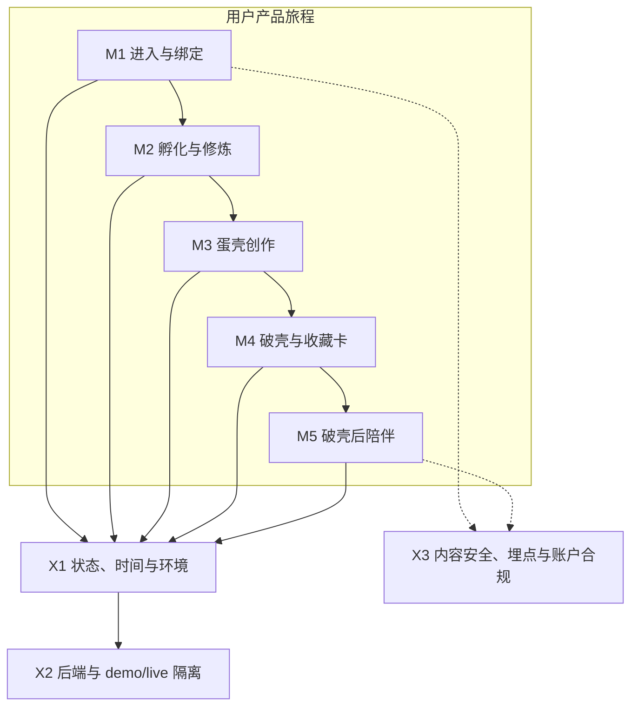

# 蛋宝宝 V3.6 业务模块对照表

> 生成日期：2026-08-05  
> 用途：把产品口径、用户入口、代码、状态、接口和测试放在同一张人类可读的地图上。  
> 本文不是新的产品需求；出现冲突时，仍按 V3.5 / V3.6 主 PRD、实现口径和技术接口规格的优先级执行。

## 1. 阅读方式

不再逐个解释 Graphify 的 92 个算法 Community。项目统一按以下 5 个用户旅程模块和 3 个横向基础能力理解：

状态说明：

- **已验证**：当前前端实现和本地自动化验证均存在。
- **live 待闭环**：前端适配已存在，但正式后端、配置或端到端环境未提供。
- **部分落地**：明确存在未提供的产品、法务或正式素材条件。
- **暂不实施**：当前 PRD 明确不放行，不应补做或预埋。

## 2. 业务模块总表

| 模块 | 用户目的 | 主要实现链路 | 当前状态 | 下一步重点 |
|---|---|---|---|---|
| M1 进入与绑定 | 授权进入、激活实体蛋、建立唯一身份与昵称 | `welcome / add-device / nickname` → `runtime-context / cloud-api / pet-store` | **live 待闭环** | 提供正式登录、激活码核销、绑定与测试账号 |
| M2 孵化与修炼 | 按日解锁许愿池、修炼课堂和孵化动作，达到破壳门槛 | `home / wish / lesson` → `incubation-practice` → `cloud-api / pet-store` | **部分落地** | 正式服务端权威修炼值；出生礼物、性格测试素材；连续登录法务结论 |
| M3 蛋壳创作 | 使用固定画笔完成并保存自己的蛋壳 | `doodle` → `egg-shell-art / canvas-2d` → `pet-store / cloud-api` | **live 待闭环** | 正式保存、版本冲突和跨设备同步验证 |
| M4 破壳与收藏卡 | 校验破壳门槛；收藏卡实现保留但 V3.6 / V3.7 用户不可触达 | `hatch / collection-card / h5-card` → `birth-card-h5 / cloud-api / pet-store` | **延后开放** | 正式版完成破壳后回主流程；收藏卡仅 develop 验收 |
| M5 破壳后陪伴 | 查看三屏生活空间、完成居家固定动作、居家对话和进入我的 / 设置 | `home / life-scene / chat / my` → `post-hatch-companion / chat-service` | **部分落地** | 正式后端读取、居家动作与对话接口、角色与场景素材；回忆模块延后开放 |
| X1 状态、时间与环境 | 保证同一只蛋状态稳定、业务时间可信、环境视觉确定 | `pet-store / runtime-context / time-service / environment-state` | **已验证，live 时间待后端** | 将 `pet-store` 作为高风险核心模块管理；接入服务端权威时间 |
| X2 后端与 demo/live 隔离 | develop 可验收，trial/release 不得假成功或污染正式数据 | `build-environment / v2 / cloud-api / sync-queue / storage-migration` | **门禁已验证，live 未接入** | `backendEnabled=false`、`apiBase` 为空；需要正式与预发布环境 |
| X3 安全、埋点与账户合规 | 输入输出安全、白名单埋点、注销可审计 | `chat-safety / chat-service / analytics / deregister / cloud-api` | **前端已验证，端到端待闭环** | 后端双向内容安全、审计、注销冷静期和正式埋点验证 |

## 3. 模块详细对照

### M1 · 进入与绑定

- **产品口径**：正式用户 ID、激活码判定、绑定关系和业务时间只能由服务端生成；激活码必须原子核销，绑定成功后才消耗额度。
- **用户入口**：`pages/welcome`、`pages/add-device`、`pages/nickname`、`pages/profile`。
- **核心状态**：`utils/pet-store.js` 保存当前用户与蛋宝宝；`services/runtime-context.js` 保存模式和服务端会话。
- **live 接口**：`bootstrap`、`redeemActivationCode`、`updateProfile`、`updateEggName`、`uploadAvatar`，集中在 `services/cloud-api.js:74-149`。
- **验证**：`demo-pages.test.js` 覆盖开发版授权、固定验收码和绑定；`cloud-api.test.js` 覆盖正式请求字段、超时和头像上传；`release-gate.test.js` 验证正式版后端门禁。
- **判断**：前端流程与适配层已经存在；正式身份、激活码核销和绑定成功仍依赖后端，不能仅凭本地 demo 判定为上线完成。

### M2 · 孵化与修炼

- **产品口径**：被动修炼每满 24 小时增加 10 点；主动模块按固定表增加；每日与一次性模块分别幂等；总值封顶 100；昵称、出生礼物和孵化回顾仍是破壳强制门槛。
- **用户入口**：`pages/home`、`pages/wish`、`pages/lesson`，破壳门槛由 `pages/hatch` 消费。
- **核心服务**：`services/incubation-practice.js` 负责当前手册、模块解锁、提交和破壳门槛；`services/time-service.js` 阻止设备时间成为 live 业务时间。
- **live 接口**：`getIncubationManual`、`getIncubationPractice`、`submitIncubationAction`，见 `services/cloud-api.js:88-100`。
- **验证**：`scripts/verify-incubation-practice-v35.js` 覆盖修炼值、解锁、幂等和首页约束；`navigation-interactions.test.js` 覆盖入口解锁和导航；`verify-v2.js` 覆盖普通版核心合规。
- **未闭环条件**：出生礼物选项与素材未提供；性格测试题目、结果模型和素材未提供；连续登录压缩的法务结论未完成。

### M3 · 蛋壳创作

- **产品口径**：使用唯一固定画笔，不提供用户上传图片；结构化编辑数据是事实来源，预览图仅为缓存。
- **用户入口**：`pages/doodle`，首页通过场景动作进入。
- **核心服务**：`services/egg-shell-art.js`、`utils/canvas-2d.js`、`utils/pet-store.js`。
- **live 接口**：`saveEggCreation`，见 `services/cloud-api.js:81-83`。
- **验证**：`scripts/verify-egg-shell-art.js`、`doodle-layout.test.js`、`navigation-interactions.test.js`。
- **判断**：本地绘图、保存状态和页面行为已验证；正式保存、版本冲突、跨设备同步与预览 URL 仍需后端联调。

### M4 · 破壳与收藏卡

- **产品口径**：达到 100 后仍需昵称、出生礼物和孵化回顾；收藏卡代码与数据规则保留，但 V3.6 / V3.7 正式版不展示收藏卡页面。
- **用户入口**：`pages/hatch`、`pages/collection-card`、`pages/h5-card`，H5 位于 `h5/birth-card/`。
- **核心服务**：`services/birth-card-h5.js`、`utils/pet-store.js`、`services/demo-experience.js`。
- **live 接口**：`generateHatchCard`，见 `services/cloud-api.js:76`；正式收藏卡数据由后端注入 H5。
- **验证**：`scripts/verify-h5.js`、`h5/birth-card/tests/card-model.test.js`、`bridge.test.js`、`demo-pages.test.js`。
- **未闭环条件**：出生礼物内容尚未提供；`birthCardH5Url`、`birthCardApiBase` 和小程序码 URL 仍为空；相册授权和正式域名需要真机验证。

### M5 · 破壳后陪伴

- **产品口径**：三屏连续空间；每 5 小时一个稳定状态；仅家、旅行、打工、上学四个大场景；八个居家状态均有固定动作且可进入完整对话页，外出显示空房且无沟通入口；右下角直达我的 / 设置。收藏卡、明信片、纪念物与旅途回放在 V3.6 / V3.7 正式版不可触达。
- **用户入口**：`pages/home`、`pages/life-scene`、`pages/life-scenes`、`pages/journey-scene`。
- **核心服务**：`services/post-hatch-companion.js`、`utils/life-scenes.js`、`services/environment-state.js`、`services/chat-service.js`、`utils/memory-demo-preview.js`、`config/post-hatch-assets.js`。
- **live 接口**：`getPostHatchHome`、`performPostHatchAction`、`getPostHatchMemories`；不提供写信或回信接口，见 `services/cloud-api.js`。
- **验证**：`post-hatch-companion.test.js`、`post-hatch-panel-scenes.test.js`、`demo-pages.test.js`、`journey-scene.test.js`、`memory-demo-preview.test.js`、`release-gate.test.js`、`scene-window-geometry.test.js`、`magic-window-tokyo.test.js`、`verify-package-assets.js`。
- **当前素材进度**：玉兔卧室 6 个居家动作已有晴天日间 / 夜间完整全景，夜间睡觉另有完成关灯后的闭眼版本；东京开发预览有 12 张候选明信片和独立旅途回放页。
- **未闭环条件**：动作全景尚缺日落、非晴天与其余居家状态；东京候选图未晋级正式资产；左右屏状态素材、心情头像和三张魔法窗景区图未齐；发布前需复核候选目录上传清单；魔法窗入口继续关闭，右侧布置区不实施拖放和装饰存储。

### X1 · 状态、业务时间与环境

- **职责**：统一保存用户和蛋状态；区分设备展示时间与服务端业务时间；按稳定种子生成环境视觉。
- **核心文件**：`utils/pet-store.js`、`services/runtime-context.js`、`services/time-service.js`、`services/environment-state.js`、`services/incubation-environment.js`、`services/device-clock.js`。
- **阶段 A 发现**：`pet-store.js` 有 24 个文件直接依赖，是当前最重要的共享业务枢纽；修改时必须进行跨模块回归。
- **边界**：生命周期、破壳和每日状态使用服务端北京时间；设备时间只用于动画和环境视觉。天气视觉不读取天气 API 或定位。
- **判断**：确定性环境和设备显示时间已有测试；正式业务时间仍需服务端时间同步。

### X2 · 后端与 demo/live 隔离

- **职责**：develop 使用隔离 fixture；trial/release 固定 live，后端未配置时明确阻断，不回退 demo。
- **核心文件**：`config/build-environment.js`、`config/v2.js`、`services/runtime-context.js`、`services/cloud-api.js`、`services/sync-queue.js`、`services/storage-migration.js`。
- **当前事实**：`config/v2.js:10-17` 中 `backendEnabled=false`，`apiBase`、H5 地址和小程序码地址均为空。
- **验证**：`build-environment.test.js`、`demo-network-isolation.test.js`、`release-gate.test.js`、`cloud-api.test.js`。
- **判断**：隔离和失败门禁已经验证，但这只证明“不会假成功”，不代表 live 功能可用。

### X3 · 内容安全、埋点与账户合规

- **职责**：输入输出双检、危机兜底、白名单埋点、注销冷静期与审计。
- **用户入口**：`pages/profile`、`pages/account`、`pages/deregister`、`pages/privacy`，以及允许说话的生活场景。
- **核心服务**：`services/chat-safety.js`、`services/chat-service.js`、`services/analytics.js`、`services/safe-storage.js`、`services/cloud-api.js`。
- **live 接口**：`chatReply`、`trackEvents`、`manageDeletion`、`updateProfile`。
- **边界**：对话不得生成好感度、关系等级或剧情解锁；埋点不得上传答案正文、画像维度、货币、商店、任务或进度事件。
- **判断**：前端白名单、危机兜底和门禁已有实现；服务端内容安全、审计、删除执行和正式埋点仍需端到端验证。

## 4. 2026-08-05 本地验证结果

以下验证均通过：

- 构建环境 demo/live 隔离
- cloud API 请求字段、超时和头像上传适配
- 开发版授权、绑定、破壳和破壳后陪伴链路
- 破壳后 5 小时状态、固定动作、来信和纪念物
- 回忆页三态预览与正式数据隔离
- 正式版后端门禁
- V3.5 修炼值、解锁、幂等和首页约束
- 蛋壳绘图约束
- 收藏卡 H5 确定性渲染和原生兜底
- V3.6 普通版核心合规回归

这些结果证明当前前端与 demo 验收基线较完整，不等于正式后端和真机链路已经完成。

## 5. 下一步决策顺序

### P0 · 正式后端闭环

1. 提供预发布 API 地址、测试账号和会话签发方式。
2. 按 `cloud-api.js` 已暴露接口逐个核对请求和响应契约。
3. 完成登录、激活、孵化、破壳、收藏卡、破壳后陪伴、对话、埋点和注销的 live 端到端测试。
4. 验证服务端时间、写入幂等、跨模式拒绝和失败重试。

### P0 · 产品与法务缺口

1. 确认出生礼物的选项、资源 ID 和视觉素材。
2. 确认性格测试是否进入当前版本，并提供完整模型与素材。
3. 取得“连续登录压缩且不提示”的书面法务结论。

### P1 · 破壳后正式素材

1. 补齐角色姿态、左右屏状态素材、明信片和心情头像。
2. 补齐大理、北京、西双版纳三张正式魔法窗素材后再开放入口。
3. 保持右侧布置区为边界，不提前实现商店、装饰拖放或库存。

### P1 · 核心状态风险控制

1. 将 `pet-store.js` 变更视为全链路高风险修改。
2. 每次修改后至少回归绑定、孵化、蛋壳、收藏卡和破壳后陪伴。
3. 暂不为“看起来更整洁”而拆分；等 live 契约稳定后再决定重构。

## 6. Graphify 后续使用规则

- 完整关系图只作为底层证据库，不作为日常阅读入口。
- 默认只采信 `EXTRACTED` 关系；`INFERRED / indirect_call` 仅作候选提示。
- 查询同名文件时使用完整相对路径。
- 每次从业务模块出发提问，不从 Community 编号出发。
- 测试覆盖必须补充普通文本搜索，因为部分校验脚本通过读取源码而不是 `require()` 建立关系。
